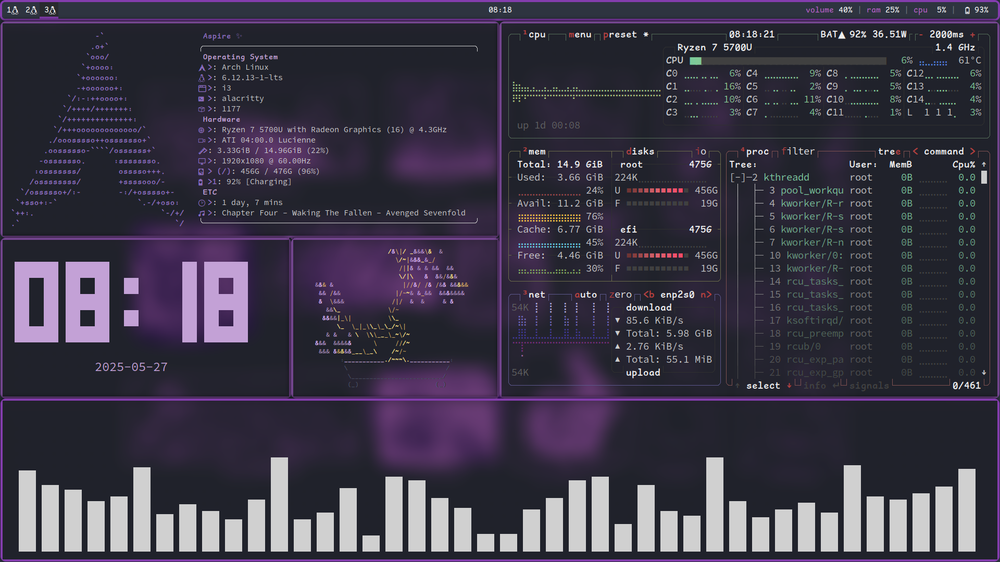

# some of my system configs :P
these are my i3wm, polybar, and another configs

[**i3-wm**](https://i3wm.org/): The Window Manager

**Polybar**: Status Bar

**Alacritty**: Terminal

**Picom**: Compositor (Transparency, Blur in some cases)

**Feh**: For Wallpapers

**Terminal Applications:** neofetch, btop, cava, tty-clock, cbonsai
